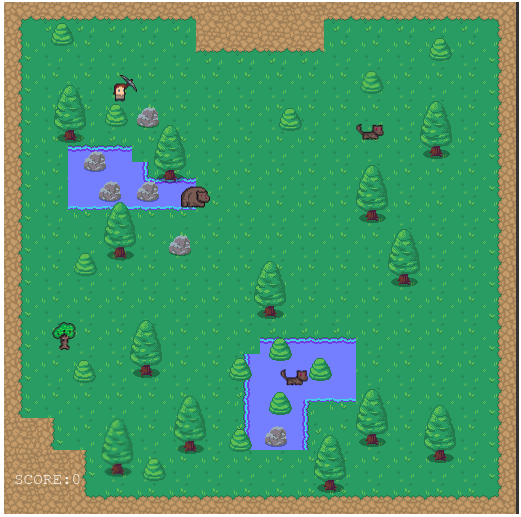

# RPG GAME(Survive-In-The-Wild)

> This repo contains source code of an RPG game built using Phaser framework and webpack.
 
 # About Game

This game is about a journey of a lone traveler through a dark wild in which there are some bears, Wolves, and Ents. Hero player needs to kill them to save itself. If you can kill your enemies, congrats, you have way too much free time on your hands and maybe you should do something better with your life. You can play piano for instance!

# Instructions To Play The Game

Up arrow - Move Up  
Left arrow - Move Left  
Down arrow - Move Down  
Right arrow - Move Right  
Mouse Left Click - Weapon Swing 

## Live Demo

<a href = 'https://lone-survivor.netlify.app/' target = 'blank'>Play</a>

## Game Design Document

<a href = 'https://docs.google.com/document/d/1KZHVj4_OjycNqJfWZkpzbE7I8Oo4hbOoQ3nWSM3w1o8/edit?usp=sharing' target = 'blank'>See Document</a>

## Set Up Project Locally

**To get this project set up on your local machine, follow these simple steps:**

**Step 1** 
Navigate through the local folder where you want to clone the repository and run 
`git@github.com:SajjadAhmad14/Survive-In-The-wild.git` to clone the repo to your local folder. 
or with https 
`https://github.com/SajjadAhmad14/Survive-In-The-wild.git`. 
**Step 2** 
Run `cd Survive-In-The-wild` 
**Step 2** 
Run `npm install` 

## Tests

Run `npm run test`

## Built With

- Phaser 3
- Javascript
- Webpack
- Jest
- Tiled
- HTML
- CSS
- VScode
- Netlify

## Authors

👤 **Sajjad Ahmad**

- GitHub: [@githubhandle](https://github.com/SajjadAhmad14)
- Twitter: [@twitterhandle](https://twitter.com/Sajjad_Ahmad14)
- LinkedIn: [LinkedIn](https://www.linkedin.com/in/sajjadahmad14)

## 🤝 Contributing

Contributions, issues, and feature requests are welcome!

Please Open a pull request if you want to add a feature or see any bug!

## Show your support

Give a ⭐️ if you like this project!

## 📝 License

This project is [MIT](lic.url) licensed.
